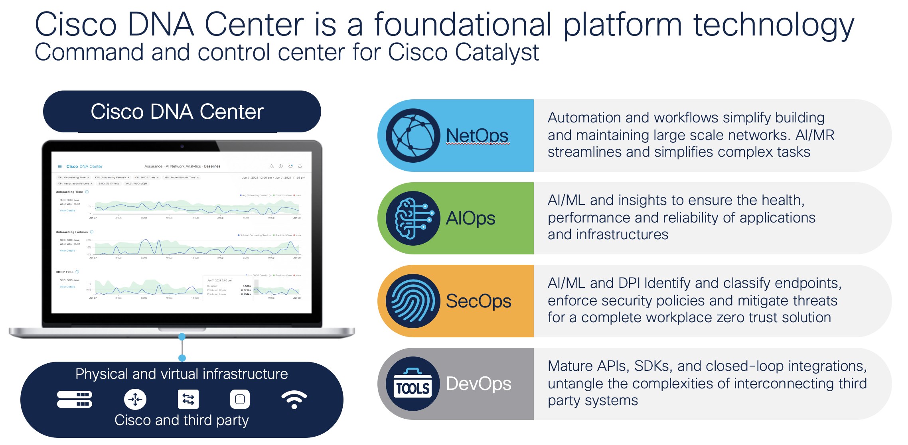

# Introduction to REST API and Postman

This set of Cisco Learning Labs is developed around a set of simple use cases to show both the power of Cisco Catalyst Center, the APIs, and easy methodologies for execution through Postman.

These Labs are designed for the Cisco DCLOUD - Catalyst Center pods for DevNet Test Drives Lab. It was developed for a Lab, which includes Cisco Catalyst Center 2.3.5.4 and equipment running at least 17.x versions of code.

## Cisco Catalyst Center

Cisco Catalyst Center is an intelligent Automation and Assurance platform for the campus. Cisco Catalyst Center enables, simplified Day-0 through Day-N management of switching, routing, and wireless infrastructure. It also improves operations with AI/ML-enhanced analytics to streamline troubleshooting and provide actionable insights into the health of the network and the quality of experience for users and applications. Here are some of the capabilities of Cisco Catalyst Center in their respective domains:

* NetOps: Network Plug and Play for Zero Touch Deployment, Software Image Management, Compliance, Configuration Templates and Network Profiles, Model-Driven Configuration, and RMA Support.
* AIOps: AI/ML-enhanced monitoring and troubleshooting support. Predictive Insights, Network Baselines, Network Reasoner, Device/Client/Application 360, Intelligent Capture.
* SecOps: AI Endpoint Analytics, Group-Based Policy and Analytics, Software-Defined Access
* DevOps: ITSM Integrations, APIs, SDK & Ansible Module 

## Use Case Lab Approach

These Labs are organized as use cases, and each use case has an associated API Collection.

1. Building a Hierarchy
2. Defining Settings and Credentials
3. Device Discovery
4. Deploying Projects and Templates
5. Downloading Configuration Archives
6. Retrieving Network Inventory
7. Running Show Commands

## Prerequisites

To effectively run the Labs, install the following tools on your computer:

> **NOTE**:  Cisco AnyConnect VPN Client: Required to connect your workstation to Cisco DCLOUD. You can download it from the [AnyConnect Download Site](https://dcloud-rtp-anyconnect.cisco.com). For more information, refer to the [DCLOUD AnyConnect Documentation](https://dcloud-cms.cisco.com/help/android_anyconnect).

> **NOTE**: Postman: An API platform for building and using APIs. Download it from [the Postman website](https://www.postman.com/downloads/).

> **NOTE**: Google Chrome: Recommended for working in the Cisco Catalyst Center UI in these Labs. Download it from the [Chrome website](https://www.google.com/chrome/downloads/).

### DCLOUD VPN Connection

Use AnyConnect VPN to connect to DCLOUD. When connecting, look at the session details and copy the credentials given by the **instructor** into the client to connect.

